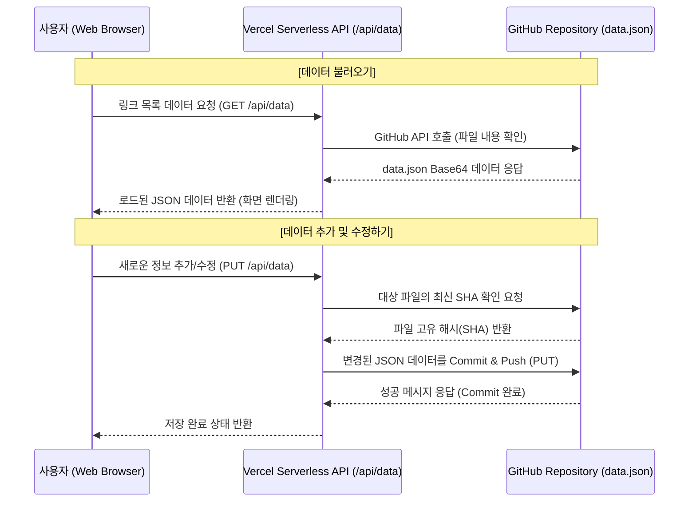

# Link Hub (링크 허브)

Link Hub는 나만의 링크 컬렉션을 관리, 정리하고 쉽게 접근할 수 있도록 설계된 웹 애플리케이션입니다. 사용자 친화적인 대시보드를 통해 제목, 설명, 태그와 함께 링크를 저장하고, 사용자 정의 폴더로 깔끔하게 정리할 수 있습니다.

## 주요 기능
- **링크 관리**: 사용자 지정 제목, 설명, 태그와 함께 링크 저장
- **폴더 구성**: 커스텀 폴더를 생성하여 논리적으로 링크 그룹화
- **검색 및 필터링**: 제목, 설명, URL 검색 및 태그 필터링을 통해 빠르게 링크 탐색
- **모던 UI**: React를 기반으로 한 깔끔하고 반응형의 글래스모피즘(Glassmorphism) 디자인

## 서버 없는 데이터 영구 저장 구조 (Serverless Architecture)

Link Hub는 별도의 백엔드 데이터베이스(DB) 서버 없이, **Vercel Serverless Functions**와 **GitHub REST API**를 활용하여 GitHub 저장소에 위치한 `data.json` 파일을 데이터베이스처럼 활용합니다. 

### 데이터 흐름 다이어그램



* **로컬 서버**: 개발 환경(Local)에서는 GitHub API를 호출하지 않고, Vite 설정 파일(`vite.config.ts`)에 구현된 커스텀 플러그인(`local-data-plugin`)이 Vercel API 역할을 대신 가로채어 로컬 파일시스템의 `data.json`을 직접 읽고 씁니다.
* **프로덕션 (Vercel)**: 사용될 때만 잠깐 깨어나는 Vercel Serverless 함수(`api/data.ts`)가 백엔드 역할을 수행하며, 링크를 수정할 때마다 자동으로 GitHub로 커밋(Commit)하기 때문에 유지 보수 서버가 전혀 필요하지 않게 데이터를 영구 보존할 수 있습니다.

## 기술 스택
- **프론트엔드**: React 19, TypeScript, Vite, React Router DOM, Lucide React (아이콘)
- **스타일링**: Vanilla CSS (글래스모피즘, CSS 변수 활용)
- **백엔드 / API**: Vercel Serverless Functions (`@vercel/node`)
- **데이터 저장소**: GitHub REST API (프로덕션 환경) / Local Filesystem (개발 환경)

## 시작하기 (로컬 개발 환경)

로컬에서 애플리케이션을 실행하면, 데이터는 프로젝트 폴더 내 `data.json` 파일에 읽고 쓰여집니다.

1. **레포지토리 클론:**
   ```bash
   git clone <레포지토리 URL>
   cd link-hub
   ```

2. **의존성 패키지 설치:**
   ```bash
   npm install
   ```

3. **개발 서버 실행:**
   ```bash
   npm run dev
   ```

4. 웹 브라우저를 열고 Vite가 제공하는 로컬 주소(보통 `http://localhost:5173`)로 접속합니다.

## 배포 및 환경 설정 (Vercel)

Vercel을 통해 손쉽게 서버를 구축할 수 있습니다. 정상적으로 데이터를 관리하기 위해선 Vercel 프로젝트 환경 설정이 필요합니다.

1. 개발된 내용을 본인의 GitHub 저장소에 푸시(Push)합니다.
2. [Vercel](https://vercel.com/) 로그인 후 해당 GitHub 저장소를 불러와 신규 프로젝트를 생성합니다.
3. 프로젝트 설정(Settings) -> **Environment Variables(환경 변수)** 섹션에서 아래 값을 추가합니다:
   - `GITHUB_TOKEN`: GitHub Personal Access Token (파일을 수정해야 하므로 `repo` 권한 체크 필수)
   - `GITHUB_OWNER`: GitHub의 본인 닉네임 또는 조직(Organization)명
   - `GITHUB_REPO`: 저장소 이름 (예: `link-hub`)
   - `GITHUB_BRANCH`: 데이터 커밋을 기록할 브랜치 이름 (기본값: `main`)
4. 환경 변수 세팅 후 Deploy(배포) 합니다. Vercel은 자동으로 `api/data.ts`를 식별하고 배포하여 `/api/data` 경로로 Serverless 환경을 구축합니다.

## 디렉토리 구조

```text
link-hub/
├── api/                   # Vercel Serverless 함수
│   └── data.ts            # GitHub API 연동 및 data.json을 처리하는 엔드포인트
├── src/                   # React 프론트엔드 소스코드
│   ├── assets/            # 정적 파일
│   ├── components/        # 공통 UI 컴포넌트 (Button, Input, Modal, LinkCard 등)
│   ├── context/           # 전역 데이터 상태 관리를 위한 React Context
│   ├── hooks/             # 커스텀 훅
│   ├── layouts/           # 페이지 레이아웃 (Sidebar 등)
│   ├── pages/             # 메인 화면별 컴포넌트 (대시보드, 폴더 목록 등)
│   ├── services/          # 외부 API 서버와 통신하는 로직
│   ├── types/             # TypeScript 타입 인터페이스
│   ├── App.tsx            # 메인 앱 파일
│   ├── main.tsx           # React 실행 진입점 
│   └── index.css          # 글로벌 스타일 및 CSS 변수 토큰
├── vite.config.ts         # 로컬 DB 환경 구현을 위한 Vite 설정 및 플러그인
├── vercel.json            # Vercel API 라우팅 설정 파일
└── package.json           # 앱 의존성과 실행 스크립트
```
